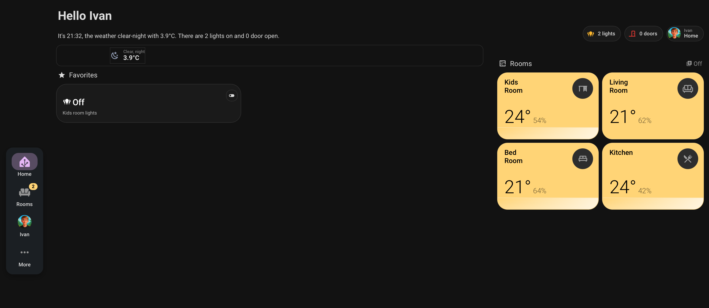
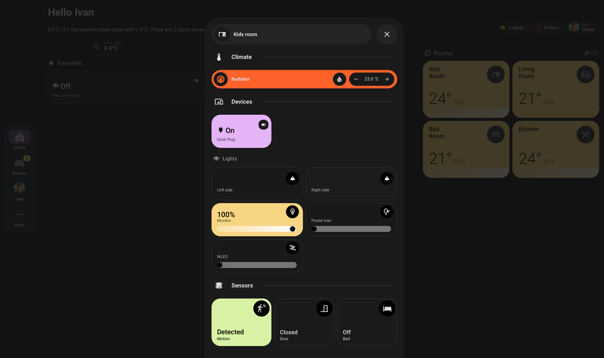

# 🏠 Inteligentná domácnosť (Home Assistant)

Tento projekt predstavuje komplexný systém smart domácnosti postavený na **Home Assistant** a vlastnom hardvéri s čipmi **ESP32 / ESP8266**.
Ako čo nastaviť kďe čo nainštalovať na to tu mate [návod.](Home_Assistant_navod.pdf)

---

## 🛠️ Hardvérové moduly
Každý priečinok obsahuje schémy, 3D modely krabičiek a kód potrebný na zostrojenie:

* [**Pohybové čidlo**](./pohybove_cidlo) – Detekcia pohybu a automatizácia svetiel.
* [**Roleta**](./roleta) – Motorizované ovládanie a nastavenie pozície.
* [**Teplomer**](./teplomer) – Presné meranie teploty a vlhkosti.

---

## 📊 Dashboard a Užívateľské rozhranie

Vzhľad môjho dashboardu je inšpirovaný tvorbou YouTubera [**HA Dashboards**](https://www.youtube.com/@HADashboards), ktorého postupy som adaptoval pre potreby môjho projektu.

### ⚠️ Požiadavky (HACS)
Pre správne zobrazenie dashboardu je nevyhnutné mať nainštalovaný **HACS** a cez neho stiahnuté tieto frontend doplnky:

| Kategória | Doplnky (Frontend) |
| :--- | :--- |
| **Karty** | `Bubble Card`, `Mushroom`, `Button Card`, `Mini Graph Card`, `My Cards Bundle` |
| **Layout** | `Layout Card`, `Swipe Card`, `Navbar Card` |
| **Dizajn/Funkcie** | `Card Mod`, `Browser Mod`, `Animated Weather Card` |

### Inštalácia Dashboardu
1. Nainštalujte všetky vyššie uvedené doplnky cez HACS.
2. Vytvorte nový prázdny dashboard v Home Assistantovi.
3. Prepnite do **YAML editora** a vložte kód zo súboru: [dashboard_config.yaml](dashboard/dashboard_config.yaml).

### Ukážka môjho nastavenia

